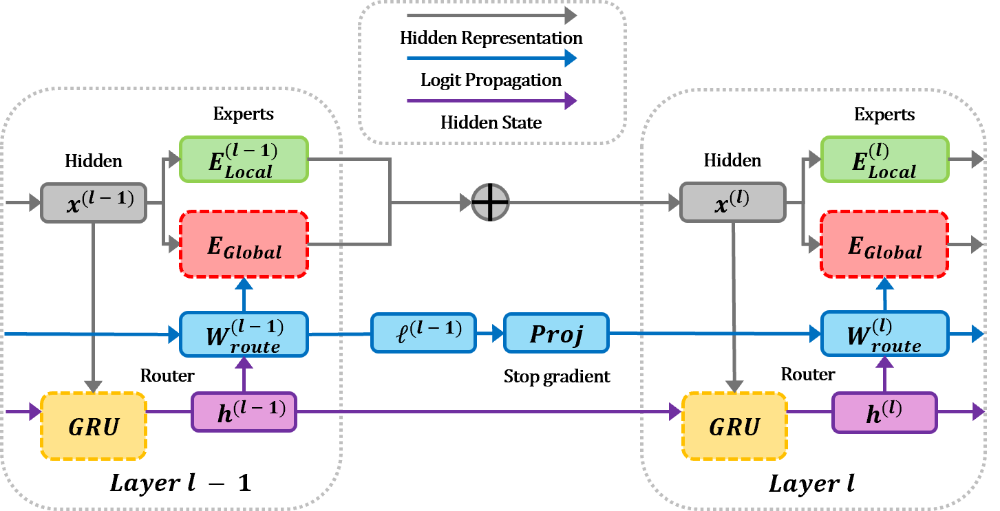

<div align="center">

---

<h3><b>😎 GMoE: Global Mixture of Experts with Logit Propagation 😎</b></h3>

<p>
  <a href="https://scholar.google.com/citations?user=F7_dQJIAAAAJ&hl=ko">Geonwoo Hong</a>, <a href="https://scholar.google.com/citations?user=5dGWexcAAAAJ&hl=en">Taehwan Kim</a>
</p>

<p>
  This repository provides an implementation of GMoE, accepted to
  <a href="https://2026.aclweb.org/">ACL 2026</a>.
</p>

<p align="center">
  <a href="#4-installation">Installation</a> |
  <a href="#5-training">Training</a> |
  <a href="#6-evaluation">Evaluation</a> |
  <a href="#7-citation">Citation</a>
</p>

</div>

<div align="center"> <a href="https://aclanthology.org/2026.acl-long.2065/"></a> &ensp; <a href="https://github.com/GEONWOOHONG/GMoE"></a> &ensp; <a href="https://huggingface.co/Geonwoohong/GMoE"></a> &ensp; </div>

---

### 1. Abstract

Sparse Mixture of Experts (SMoE) architectures reduce computational cost by activating only a subset of experts per token, yet they often retain large memory footprints and exhibit significant redundancy, both within and across layers. We propose GMoE, a sparse MoE architecture designed to explicitly address these inefficiencies. Instead of maintaining separate expert sets for each layer, GMoE uses Global Experts shared across all layers and adds a Local Expert per layer for layer-specific adaptation. This architecture reuses Global Experts across layers, thereby mitigating inter-layer redundancy while substantially reducing model parameters. In addition, we introduce a Global Router with a GRU-based recurrent component shared across layers and layer-specific routing heads that propagate routing logits across layers. This routing mechanism couples routing decisions across layers, progressively refines routing paths, and helps mitigate intra-layer redundancy. Across diverse language modeling corpora and downstream benchmarks, GMoE remains competitive while using substantially fewer parameters. Path-level routing analyses and an ablation study show that GMoE reduces cross-layer routing concentration and increases path diversity, with Global Experts, a Local Expert at each layer, and the Global Router all contributing to the gains.

### 2. Overview

<p align="center">
  
</p>

### 3. What This Repository Provides

- <a href="https://github.com/GEONWOOHONG/GMoE/blob/main/config.py">`config.py`</a>: defines the repository-wide configuration, including workspace paths, Hugging Face cache directories, checkpoint directories, and model specifications for the Small, Base, and Large GMoE variants.

- <a href="https://github.com/GEONWOOHONG/GMoE/blob/main/data.py">`data.py`</a>: provides the dataset loading utilities, including Hugging Face dataset preparation, distributed-safe caching, worker seeding, dataloader generator setup, and Pile train/validation/test loading.

- <a href="https://github.com/GEONWOOHONG/GMoE/blob/main/eval.py">`eval.py`</a>: provides the perplexity evaluation pipeline for released GMoE checkpoints, including checkpoint loading, model reconstruction, GPT-2-to-GMoE conversion, forward-pass patching, FlashAttention/SDP backend setup, and evaluation over Pile, WikiText-103, CC100, and OpenWebText.

- <a href="https://github.com/GEONWOOHONG/GMoE/blob/main/modeling.py">`modeling.py`</a>: defines the GMoE architecture, including the expert module, the shared GRU-based recurrent router, the GMoE layer that combines shared Global Experts with a layer-specific Local Expert, and the utility that replaces GPT-2 MLP layers with GMoE layers.

- <a href="https://github.com/GEONWOOHONG/GMoE/blob/main/patches.py">`patches.py`</a>: defines the GPT-2 forward-pass patches required to run the converted model, including the modified block and transformer forward functions that pass routing states across layers and apply the causal attention mask during inference and training.

- <a href="https://github.com/GEONWOOHONG/GMoE/blob/main/train.py">`train.py`</a>: provides the GMoE training pipeline, including distributed training setup, GPT-2 backbone initialization, GMoE conversion, dataset loading, mixed-precision training, auxiliary load-balancing loss computation, validation, TensorBoard logging, checkpoint saving, and resume support.

- <a href="https://github.com/GEONWOOHONG/GMoE/blob/main/utils.py">`utils.py`</a>: provides shared training and evaluation utilities, including seed control, optimizer and scheduler setup, FlashAttention/SDP backend configuration, chunked cross-entropy computation, safetensors checkpoint saving/loading, active-parameter estimation, and model configuration reporting.

### 4. Installation

To install the dependencies, run:

```bash
git clone https://github.com/GEONWOOHONG/GMoE.git
cd GMoE

conda create -n GMoE python=3.11 -y
conda activate GMoE

python -m pip install --upgrade pip setuptools wheel

python -m pip install torch==2.7.1 torchvision==0.22.1 torchaudio==2.7.1 \
  --index-url https://download.pytorch.org/whl/cu126

python -m pip install -r requirements.txt
```

### 5. Training

To train GMoE, run:

```bash
python train.py \
  --model_size base \
  --num_global_experts 16 \
  --batch_size 64 \
  --seq_len 1024 \
  --grad_accum 1 \
  --alpha 0.01
```

For multi-GPU training, run:

```bash
torchrun --nproc_per_node=8 train.py \
  --model_size base \
  --num_global_experts 16 \
  --batch_size 64 \
  --seq_len 1024 \
  --grad_accum 1 \
  --alpha 0.01
```

If you want to adjust the amount of training data, you can modify `MAX_TRAIN_SHARDS` at the top of `data.py`, where values from `1` to `30` control the number of training shards and therefore the number of training tokens.

```python
MAX_TRAIN_SHARDS = 1
```

If you want to add a new model size, you can define a new entry in `MODEL_SPECS` in `config.py`.

```python
MODEL_SPECS = {
    "tiny": {
        "n_embd": 256,
        "n_layer": 3,
        "n_head": 4,
        "d_ff": 1024,
    },
    ...
}
```

### 6. Evaluation

To evaluate a trained checkpoint, run:

```bash
python eval.py \
  --checkpoint ./workspace/checkpoints/gmoe_base_e16 \
  --model_size base \
  --num_global_experts 16 \
  --batch_size 64
```

If you want to evaluate the released GMoE checkpoints from Hugging Face, run:

```bash
mkdir -p ./workspace/checkpoints

hf download Geonwoohong/GMoE \
  --repo-type model \
  --include "GMoE_Base/*" "GMoE_Small/*" "GMoE_Large/*" \
  --local-dir ./workspace/checkpoints/GMoE

python eval.py \
  --checkpoint ./workspace/checkpoints/GMoE/GMoE_Small \
  --model_size small \
  --num_global_experts 16 \
  --batch_size 64

python eval.py \
  --checkpoint ./workspace/checkpoints/GMoE/GMoE_Base \
  --model_size base \
  --num_global_experts 16 \
  --batch_size 64

python eval.py \
  --checkpoint ./workspace/checkpoints/GMoE/GMoE_Large \
  --model_size large \
  --num_global_experts 16 \
  --batch_size 64
```
To evaluate the additional 32- and 64-expert GMoE checkpoints, run:

```bash
mkdir -p ./workspace/checkpoints

hf download Geonwoohong/GMoE \
  --repo-type model \
  --include "GMoE_Small_32/*" "GMoE_Base_32/*" "GMoE_Base_64/*" "GMoE_Large_32/*" "GMoE_Large_64/*" \
  --local-dir ./workspace/checkpoints/GMoE

python eval.py \
  --checkpoint ./workspace/checkpoints/GMoE/GMoE_Small_32 \
  --model_size small \
  --num_global_experts 32 \
  --batch_size 64

python eval.py \
  --checkpoint ./workspace/checkpoints/GMoE/GMoE_Base_32 \
  --model_size base \
  --num_global_experts 32 \
  --batch_size 64

python eval.py \
  --checkpoint ./workspace/checkpoints/GMoE/GMoE_Base_64 \
  --model_size base \
  --num_global_experts 64 \
  --batch_size 64

python eval.py \
  --checkpoint ./workspace/checkpoints/GMoE/GMoE_Large_32 \
  --model_size large \
  --num_global_experts 32 \
  --batch_size 64

python eval.py \
  --checkpoint ./workspace/checkpoints/GMoE/GMoE_Large_64 \
  --model_size large \
  --num_global_experts 64 \
  --batch_size 64
```

### 7. Citation

```bibtex
@inproceedings{hong-kim-2026-gmoe,
    title = "{GM}o{E}: Global Mixture of Experts with Logit Propagation",
    author = "Hong, Geonwoo  and
      Kim, Taehwan",
    editor = "Liakata, Maria  and
      Moreira, Viviane P.  and
      Zhang, Jiajun  and
      Jurgens, David",
    booktitle = "Proceedings of the 64th Annual Meeting of the {A}ssociation for {C}omputational {L}inguistics (Volume 1: Long Papers)",
    month = jul,
    year = "2026",
    address = "San Diego, California, United States",
    publisher = "Association for Computational Linguistics",
    url = "https://aclanthology.org/2026.acl-long.2065/",
    doi = "10.18653/v1/2026.acl-long.2065",
    pages = "44599--44614",
    ISBN = "979-8-89176-390-6",
    abstract = "Sparse Mixture of Experts (SMoE) architectures reduce computational cost by activating only a subset of experts per token, yet they often retain large memory footprints and exhibit significant redundancy, both within and across layers. We propose GMoE, a sparse MoE architecture designed to explicitly address these inefficiencies. Instead of maintaining separate expert sets for each layer, GMoE uses Global Experts shared across all layers and adds a Local Expert per layer for layer-specific adaptation. This architecture reuses Global Experts across layers, thereby mitigating inter-layer redundancy while substantially reducing model parameters. In addition, we introduce a Global Router with a GRU-based recurrent component shared across layers and layer-specific routing heads that propagate routing logits across layers. This routing mechanism couples routing decisions across layers, progressively refines routing paths, and helps mitigate intra-layer redundancy. Across diverse language modeling corpora and downstream benchmarks, GMoE remains competitive while using substantially fewer parameters. Routing path analyses and an ablation study show that GMoE reduces cross-layer routing concentration and increases path diversity, with the Global Experts, the Local Expert, and the Global Router all contributing to the gains. The code is available at https://github.com/GEONWOOHONG/GMoE."
}
```
